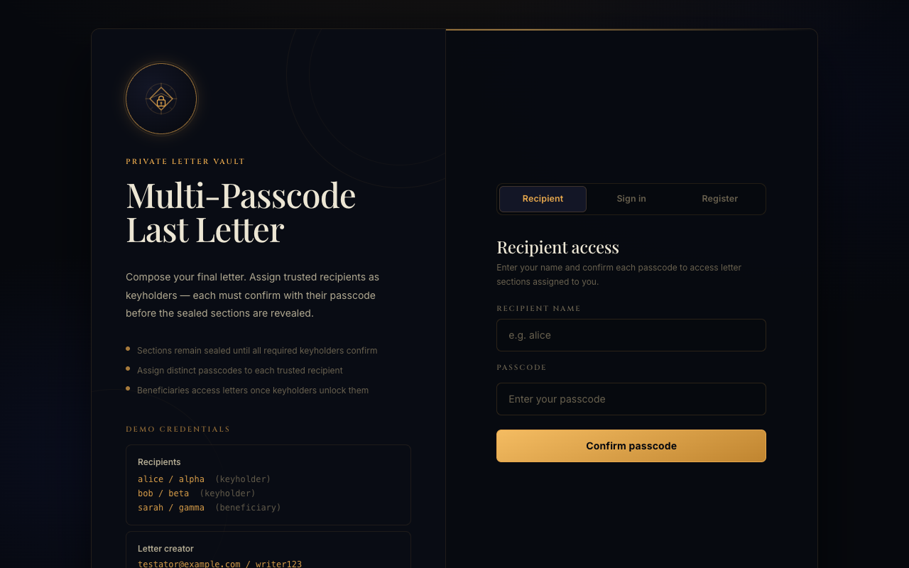
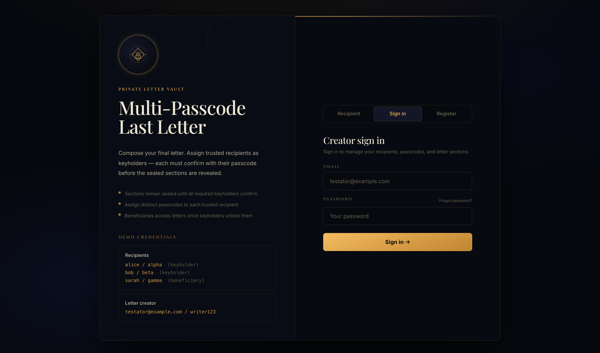
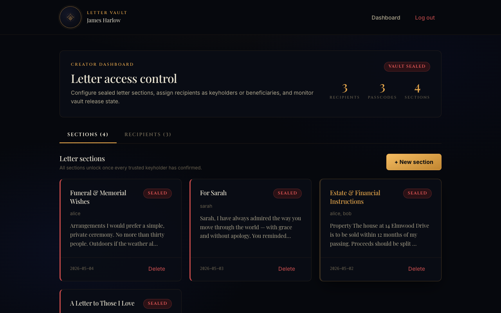
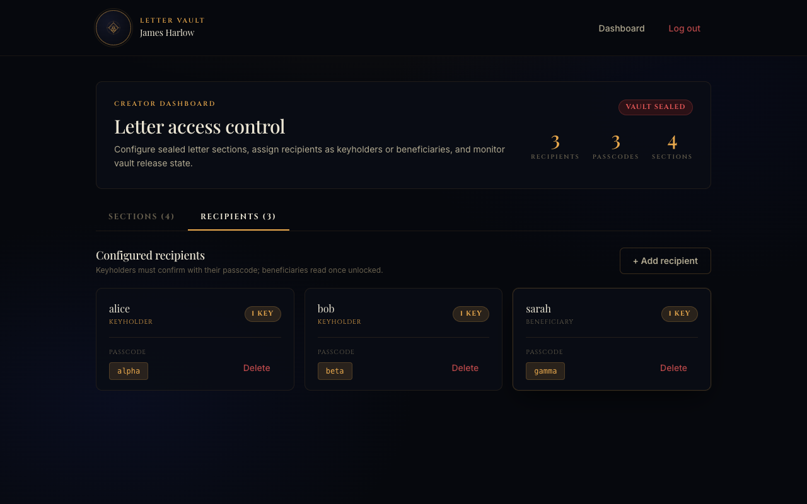
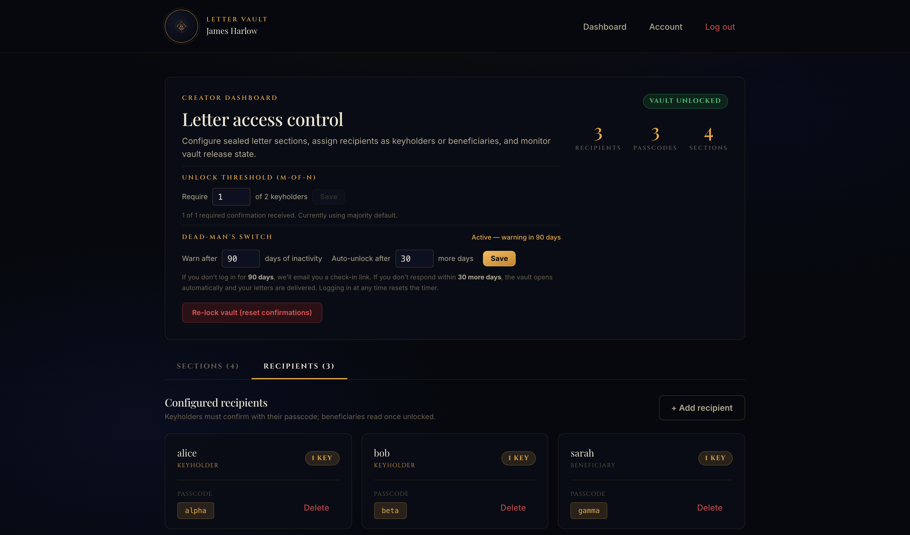
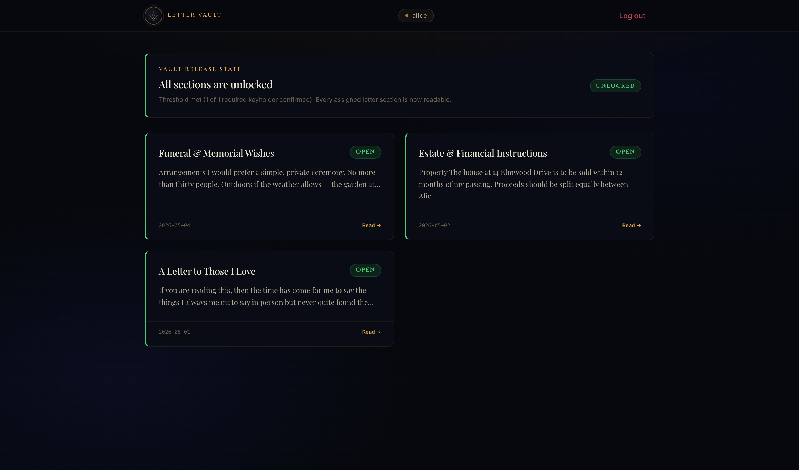

# Letter Vault

There are things we mean to say but never find the right moment for. Things we'd only want someone to read after we're gone. Words we'd write differently if we knew they were final.

**Letter Vault** is a private posthumous letter system built for that purpose.

You write sealed letter sections — personal messages, final wishes, things you've been meaning to say. You assign each section to the people who should read it. Then you lock it, and trust that it will reach them when the time comes.

The vault stays sealed for as long as you're alive and checking in. If you stop — the system notices. It sends a warning. If you don't respond, the letters are delivered. Quietly. To the right people. With their names and their passcodes, just as you set them up.

Unlike simple "send after death" services, Letter Vault uses a **multi-keyholder confirmation system**: trusted people in your life must confirm with a passcode before the vault opens. You decide how many — all of them, or just a majority. If one keyholder dies or goes missing, the others can still unlock. No single point of failure.

You can also schedule individual sections for specific dates — a letter that opens on a child's 18th birthday, one that arrives on a wedding anniversary five years from now, one that delivers the moment the vault opens and another that follows a year later.

Every section can carry text, photos, voice recordings, and video messages. Because last words deserve more than a paragraph of plain text.

**Letter Vault is self-hosted and open source.** Your letters never pass through a third-party service. The content is encrypted at rest. You own the keys.

**Live:** https://letter-vault.saihtet.dev

---

## Screenshots

### Auth — Recipient Access


### Auth — Creator Sign In


### Creator Dashboard — Sections


### Creator Dashboard — Recipients


### New Section — Media & Attachments


### Reader Portal


---

## How It Works

### Roles

| Role | Description |
|---|---|
| **Creator** | Registers an account, writes letter sections, and assigns recipients |
| **Keyholder** | A trusted recipient whose passcode confirmation is required to unlock the vault |
| **Beneficiary** | A recipient who reads assigned sections once the vault opens |

### Workflow

```
Creator                    Keyholders                   Beneficiaries
   │                           │                             │
   ├─ Register + verify email  │                             │
   ├─ Add recipients           │                             │
   │   ├─ alice (keyholder)    ◄── invitation email sent     │
   │   ├─ bob   (keyholder)    ◄── invitation email sent     │
   │   └─ sarah (beneficiary)  ─────────────────────────────►│ invitation
   ├─ Write letter sections    │                             │
   │   ├─ global unlock        │                             │
   │   ├─ fixed date           │                             │
   │   └─ delay after unlock   │                             │
   ├─ Set unlock threshold     │                             │
   │   └─ e.g. 2 of 3          │                             │
   └─ Configure dead-man's switch                            │
       (inactivity / grace / keyholder-grace days)           │
                                                             │
─── Creator inactive for 90 days ──────────                  │
   ◄── check-in email "Are you still here?"                  │
                                                             │
─── No response for 30 more days (DMS fires) ──              │
                          ◄── only keyholders                │
                              notified to confirm            │
                                                             │
                          alice confirms ──┐                 │
                          bob confirms ────┴── threshold met │
                                                             │
                                               Vault opens ──►│ "your letter is ready"
                                                             │
   ── OR — if keyholders silent for 14 more days ──          │
              Force-unlock + everyone notified ─────────────►│
```

#### Unlock flow

The vault opens through a staged process that requires both the dead-man's switch to fire **and** keyholders to confirm — with a final safety net if keyholders are unreachable.

**Stage 1 — Inactivity warning**
If the creator doesn't log in for `inactivity_days` (default 90), a check-in email is sent with an "I'm still here" link. Clicking the link resets the timer.

**Stage 2 — DMS fires, keyholders notified**
If the creator doesn't respond within `grace_days` (default 30), the dead-man's switch fires. **Only keyholders** receive an email asking them to log in and confirm with their passcode. Beneficiaries are not notified yet.

**Stage 3 — Vault opens**
The vault opens via one of two paths:

- **Keyholder confirmation (M-of-N)** — once the required number of keyholders confirm, the vault opens and **beneficiaries are notified**. The threshold is configurable (default: majority). If a keyholder dies or goes missing, the remaining keyholders can still reach the threshold.
- **Force-unlock** — if keyholders don't confirm within `keyholder_grace_days` (default 14), the vault opens automatically and **all recipients** are notified. This prevents letters from being stuck if every keyholder is unreachable.

**Scheduled release dates**
Individual sections can be set to open on a specific date (e.g. a birthday, an anniversary) or N days after the vault opens — independent of the staged flow above.

**Edge case — no keyholders:**
If the creator hasn't assigned any keyholders, the dead-man's switch alone opens the vault as soon as Stage 2 fires.

---

## Features

### For creators
- **Email-verified accounts** — registration requires email verification
- **Recipient management** — add keyholders and beneficiaries with passcodes and email (required); invitation email sent automatically
- **M-of-N threshold unlock** — require 1, 2, or all keyholders to confirm; vault survives a missing keyholder
- **Three-stage dead-man's switch** — configurable inactivity → warning → keyholder notification → force-unlock fallback
- **Keyholder-first notification** — when DMS fires, only keyholders are emailed first; beneficiaries only hear when the vault actually opens
- **Scheduled section releases** — global unlock, fixed date, or relative delay per section
- **Rich letter editor** — WYSIWYG text formatting
- **Voice & video messages** — record directly in the browser; stored encrypted with the section
- **Photo gallery** — attach photos displayed as a gallery grid with lightbox after unlock
- **File attachments** — PDFs, documents, any file type; downloadable after unlock
- **Section preview** — see exactly what recipients will read before sealing; send a preview to your own email
- **Account settings** — update name, email, or password; email change triggers re-verification
- **Forgot password** — secure reset link via email (expires in 1 hour)
- **Toast notifications** — confirmation after every create, update, or delete action

### For recipients
- **Reader portal** — access sealed sections with name + passcode
- **Per-section readability** — sections unlock independently based on their schedule
- **Inline audio/video playback** — voice and video messages play directly in the portal
- **Photo gallery with lightbox** — photos shown in a grid, click to view full-screen
- **Unlock notifications** — email sent when the vault opens, or when a scheduled section becomes available

---

## Technical Stack

| Layer | Technology |
|---|---|
| **Framework** | Next.js 16 (App Router) |
| **Frontend** | React 18, Tailwind CSS |
| **Database** | MySQL 8 via `mysql2` |
| **Email** | Nodemailer (SMTP — Mailtrap, SendGrid, etc.) |
| **Runtime** | Node.js 22 |
| **Process manager** | PM2 |
| **Reverse proxy** | Nginx |
| **SSL** | Let's Encrypt (auto-renewing) |

### Security

| Concern | Implementation |
|---|---|
| Writer passwords | bcrypt (12 rounds), minimum 8 characters |
| Recipient passcodes | bcrypt (12 rounds), minimum 4 characters — hashes stored, originals AES-encrypted for display |
| Letter content | AES-256-GCM at rest — unreadable without `LETTER_ENCRYPTION_KEY` |
| Sessions | HMAC-signed httpOnly cookies (writer + reader); `secure` in production |
| CSRF | Same-origin check on every mutation endpoint |
| Rate limiting | IP-based on login (8/min), register (5/min), confirm (12/min), forgot-password (5/min), cron (5/min) |
| HTML sanitization | Tag/attribute whitelist; strips `<script>`, blocks `javascript:` URIs |
| Attachments | MIME-type whitelist, 10MB size cap, validates data URI prefix |
| Email verification | SHA-256 hashed UUID token, 24-hour expiry, single-use |
| Password reset | SHA-256 hashed UUID token, 1-hour expiry |
| Heartbeat token | SHA-256 hashed; two-step (GET shows form, POST resets timer) |
| Passcode validation | Server-side only via `bcrypt.compare()` — nothing validated in the browser |
| Cron endpoint | `CRON_SECRET` bearer token + rate limit |
| Email enumeration | Forgot-password always returns 200 regardless of account existence |
| Test endpoint | `/api/test-email` blocked in production (`NODE_ENV=production`) |

### Project Structure

```
letter-vault/
├── app/
│   ├── api/
│   │   ├── cron/check/          # Daily DMS + scheduled release check
│   │   ├── heartbeat/           # Creator clicks "I'm still here" link
│   │   ├── reset-password/      # GET (form) + POST (set new password)
│   │   ├── verify-email/        # GET — verify email token
│   │   ├── test-email/          # POST — smoke-test SMTP
│   │   ├── recipients/
│   │   │   ├── route.js         # GET all (public)
│   │   │   ├── confirm/         # POST — keyholder confirms
│   │   │   └── [readerName]/sections/
│   │   └── writers/
│   │       ├── login/           # POST
│   │       ├── register/        # POST — creates unverified account + sends verification email
│   │       ├── forgot-password/ # POST — sends reset link
│   │       ├── resend-verification/
│   │       ├── reset-confirmations/
│   │       └── [writerId]/
│   │           ├── account/     # PATCH — update name/email/password
│   │           ├── data/        # GET — full dashboard data
│   │           ├── dms/         # PATCH — update dead-man's switch config
│   │           ├── preview-email/ # POST — send preview to creator's email
│   │           ├── recipients/  # POST create, DELETE remove
│   │           ├── sections/    # POST create/edit, DELETE remove
│   │           └── threshold/   # PATCH — update M-of-N threshold
│   ├── layout.jsx
│   └── page.jsx
├── src/
│   ├── App.jsx                  # Root client component & state
│   ├── styles.css               # Design system & CSS classes
│   └── components/
│       ├── AuthPage.jsx         # Login / register / forgot password / recipient confirm
│       ├── AccountSettings.jsx  # Edit name, email, password
│       ├── BlogDashboard.jsx    # Creator dashboard
│       ├── ReaderPortal.jsx     # Recipient letter view
│       ├── CreatePostForm.jsx   # Write/edit a section
│       ├── CreateReaderForm.jsx # Add a recipient
│       ├── AttachmentPlayer.jsx # Audio/video/file renderer
│       ├── DatePicker.jsx       # Custom themed calendar picker
│       ├── PhotoGallery.jsx     # Image grid + lightbox
│       ├── SectionPreviewModal.jsx # Creator preview of recipient view
│       ├── VoiceVideoRecorder.jsx  # In-browser MediaRecorder
│       ├── Toast.jsx            # Toast notification system
│       ├── ConfirmModal.jsx     # Delete confirmation dialog
│       ├── Logo.jsx             # SVG brand mark
│       ├── StatusBadge.jsx      # Sealed/Unlocked pill
│       └── WysiwygEditor.jsx    # Rich text editor
├── lib/
│   ├── db.js                   # MySQL pool, schema, migrations, seed, encrypt/decrypt
│   └── email.js                # Nodemailer transport + all email templates
└── docs/
    └── screenshots/
```

---

## Local Development

### Prerequisites

- Node.js 18+
- MySQL 8 running locally

### Setup

```bash
# Clone
git clone https://github.com/SaiHtetWaiYan/letter-vault.git
cd letter-vault

# Install dependencies
npm install

# Create environment file
cp .env.example .env.local
```

Edit `.env.local`:

```env
# Generate with: node -e "require('crypto').randomBytes(32).toString('hex')"
LETTER_ENCRYPTION_KEY=your_64_char_hex_key_here

DB_HOST=127.0.0.1
DB_PORT=3306
DB_USER=lettervault
DB_PASSWORD=your_local_password
DB_NAME=lettervault

# SMTP (optional in dev — emails logged to console if not configured)
SMTP_HOST=live.smtp.mailtrap.io
SMTP_PORT=2525
SMTP_SECURE=false
SMTP_USER=your_smtp_user
SMTP_PASS=your_smtp_password
SMTP_FROM=Letter Vault <no-reply@your-domain.com>

# Public base URL (used in email links)
NEXT_PUBLIC_BASE_URL=http://localhost:3001

# Cron secret (any random string)
CRON_SECRET=dev-secret
```

Create the local database:

```bash
mysql -u root -e "
  CREATE DATABASE lettervault CHARACTER SET utf8mb4 COLLATE utf8mb4_unicode_ci;
  CREATE USER 'lettervault'@'localhost' IDENTIFIED BY 'your_local_password';
  GRANT ALL PRIVILEGES ON lettervault.* TO 'lettervault'@'localhost';
"
```

```bash
# Start development server (tables and seed data created on first run)
npm run dev
# → http://localhost:3001
```

### Demo Credentials

| Type | Name | Credential |
|---|---|---|
| Creator | `testator@example.com` | `writer123` |
| Keyholder | `alice` | passcode: `alpha` |
| Keyholder | `bob` | passcode: `beta` |
| Beneficiary | `sarah` | passcode: `gamma` |

> Seed accounts are pre-verified and pre-seeded with example sections.

---

## Deployment

Deployed on a DigitalOcean droplet:

- **Nginx** as a reverse proxy (port 80/443 → Node port 3000)
- **PM2** for process management and auto-restart on reboot
- **Certbot** for automatic SSL renewal

### Deploy Updates

```bash
ssh root@your-server
cd /var/www/letter-vault
git pull origin main
npm install
npm run build
pm2 restart letter-vault --update-env
```

### Cron Job (dead-man's switch + scheduled releases)

Add to server crontab — runs daily at 08:00:

```bash
0 8 * * * curl -s -X POST https://your-domain.com/api/cron/check \
  -H "Authorization: Bearer your-cron-secret" \
  >> /var/log/letter-vault-cron.log 2>&1
```

---

## Environment Variables

| Variable | Required | Description |
|---|---|---|
| `LETTER_ENCRYPTION_KEY` | ✅ | 64-char hex string (32 bytes). Encrypts all letter content at rest. **Back this up — losing it makes all letters unreadable.** |
| `AUTH_SECRET` | ☑️ | Secret used to HMAC-sign session cookies. Falls back to `LETTER_ENCRYPTION_KEY` if unset, but a dedicated value is recommended. |
| `DB_HOST` | ✅ | MySQL host |
| `DB_PORT` | ✅ | MySQL port (default `3306`) |
| `DB_USER` | ✅ | MySQL username |
| `DB_PASSWORD` | ✅ | MySQL password |
| `DB_NAME` | ✅ | MySQL database name |
| `SMTP_HOST` | ☑️ | SMTP server hostname |
| `SMTP_PORT` | ☑️ | SMTP port (587 or 2525 typical) |
| `SMTP_SECURE` | ☑️ | `true` for port 465, `false` otherwise |
| `SMTP_USER` | ☑️ | SMTP username |
| `SMTP_PASS` | ☑️ | SMTP password |
| `SMTP_FROM` | ☑️ | From address shown to recipients |
| `NEXT_PUBLIC_BASE_URL` | ☑️ | Public URL used in email links |
| `CRON_SECRET` | ☑️ | Bearer token protecting `/api/cron/check` |

> ☑️ Optional but required for email features (verification, invitations, dead-man's switch, notifications).
