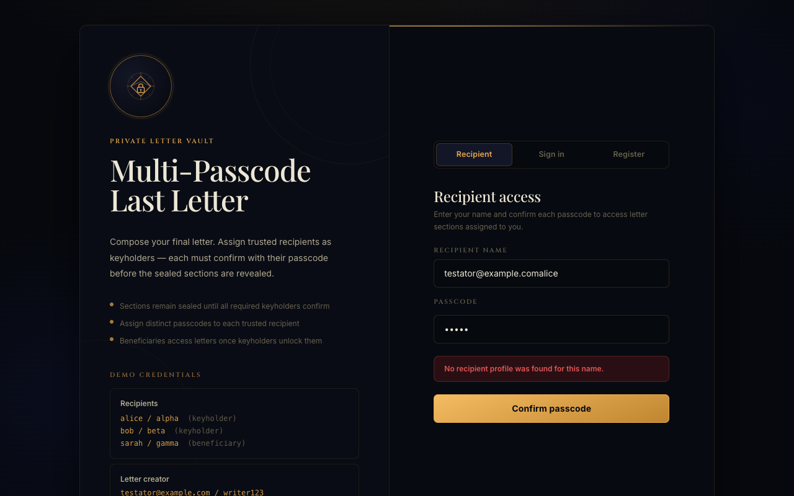

# Letter Vault

A secure multi-passcode digital letter system. Write sealed letter sections, assign trusted keyholders, and keep the contents locked until every required recipient confirms with their passcode.

**Live:** https://letter-vault.saihtet.dev

---

## Screenshots

### Auth Page


### Creator Sign In


### Writer Dashboard


### Recipients & Keys


### Reader Portal


---

## How It Works

### Roles

| Role | Description |
|---|---|
| **Creator** | Registers an account, writes letter sections, and assigns recipients |
| **Keyholder** | A trusted recipient whose passcode confirmation is required to unlock the vault |
| **Beneficiary** | A recipient who reads assigned sections once all keyholders have confirmed |

### Workflow

```
Creator                    Keyholders                  Beneficiaries
   │                           │                            │
   ├─ Register account         │                            │
   ├─ Add recipients           │                            │
   │   ├─ alice (keyholder)    │                            │
   │   ├─ bob   (keyholder)    │                            │
   │   └─ sarah (beneficiary)  │                            │
   ├─ Write letter sections    │                            │
   └─ Assign recipients        │                            │
                               │                            │
                          alice confirms ──────────────────►│ (vault still sealed)
                          bob confirms   ──────────────────►│
                                                            │
                                                     Vault unlocks globally
                                                     All sections now readable
```

1. **Creator** registers, adds recipients with passcodes, and writes sealed letter sections
2. **Keyholders** visit the site, enter their name and passcode to confirm
3. Once **all** trusted keyholders have confirmed, the vault unlocks globally
4. **All recipients** (keyholders and beneficiaries) can now read their assigned sections

> The vault is an all-or-nothing global unlock — every trusted keyholder must confirm before any section becomes readable.

---

## Technical Stack

| Layer | Technology |
|---|---|
| **Framework** | Next.js 16 (App Router) |
| **Frontend** | React 18, Tailwind CSS |
| **Database** | MySQL 8 via `mysql2` |
| **Runtime** | Node.js 22 |
| **Process manager** | PM2 |
| **Reverse proxy** | Nginx |
| **SSL** | Let's Encrypt (auto-renewing) |

### Security

| Concern | Implementation |
|---|---|
| Writer passwords | bcrypt (12 rounds) |
| Recipient passcodes | bcrypt (12 rounds) — hashes stored, originals AES-encrypted for display |
| Letter content | AES-256-GCM at rest — unreadable without `LETTER_ENCRYPTION_KEY` |
| Public API | Returns only `passcodeCount`, never passcode hashes or plaintexts |
| Passcode validation | Server-side only via `bcrypt.compare()` — nothing validated in the browser |

### Project Structure

```
letter-vault/
├── app/
│   ├── api/
│   │   ├── recipients/          # GET all, POST confirm
│   │   └── writers/
│   │       ├── login/           # POST
│   │       ├── register/        # POST
│   │       ├── reset-confirmations/
│   │       └── [writerId]/
│   │           ├── data/        # GET writer dashboard data
│   │           ├── recipients/  # POST create, DELETE remove
│   │           └── sections/    # POST create/edit, DELETE remove
│   ├── layout.jsx
│   └── page.jsx
├── src/
│   ├── App.jsx                  # Root client component & state
│   ├── styles.css               # Design system & CSS classes
│   └── components/
│       ├── AuthPage.jsx         # Login / register / recipient confirm
│       ├── BlogDashboard.jsx    # Writer dashboard
│       ├── ReaderPortal.jsx     # Recipient letter view
│       ├── CreatePostForm.jsx   # Write/edit a section
│       ├── CreateReaderForm.jsx # Add a recipient
│       ├── ConfirmModal.jsx     # Delete confirmation dialog
│       ├── Logo.jsx             # SVG brand mark
│       ├── StatusBadge.jsx      # Locked/Unlocked pill
│       └── WysiwygEditor.jsx    # Rich text editor
├── lib/
│   └── db.js                   # MySQL pool, schema, seed, encrypt/decrypt
└── docs/
    └── screenshots/
```

---

## Local Development

### Prerequisites

- Node.js 18+
- MySQL 8 running locally

### Setup

```bash
# Clone
git clone https://github.com/SaiHtetWaiYan/letter-vault.git
cd letter-vault

# Install dependencies
npm install

# Create environment file
cp .env.example .env.local
```

Edit `.env.local`:

```env
# Generate with: node -e "require('crypto').randomBytes(32).toString('hex')"
LETTER_ENCRYPTION_KEY=your_64_char_hex_key_here

DB_HOST=127.0.0.1
DB_PORT=3306
DB_USER=lettervault
DB_PASSWORD=your_local_password
DB_NAME=lettervault
```

Create the local database:

```bash
mysql -u root -e "
  CREATE DATABASE lettervault CHARACTER SET utf8mb4 COLLATE utf8mb4_unicode_ci;
  CREATE USER 'lettervault'@'localhost' IDENTIFIED BY 'your_local_password';
  GRANT ALL PRIVILEGES ON lettervault.* TO 'lettervault'@'localhost';
"
```

```bash
# Start development server (tables and seed data created on first run)
npm run dev
# → http://localhost:3001
```

### Demo Credentials

| Type | Name | Passcode |
|---|---|---|
| Keyholder | `alice` | `alpha` |
| Keyholder | `bob` | `beta` |
| Beneficiary | `sarah` | `gamma` |
| Creator | `testator@example.com` | `writer123` |

---

## Deployment

The app is deployed on a DigitalOcean droplet with:

- **Nginx** as a reverse proxy (port 80/443 → Node port 3000)
- **PM2** for process management and auto-restart on reboot
- **Certbot** for automatic SSL renewal

### Deploy Updates

```bash
ssh root@your-server
cd /var/www/letter-vault
git pull
npm install
npm run build
pm2 restart letter-vault
```

---

## Environment Variables

| Variable | Required | Description |
|---|---|---|
| `LETTER_ENCRYPTION_KEY` | ✅ | 64-char hex string (32 bytes). Encrypts all letter content at rest. **Back this up — losing it makes all letters unreadable.** |
| `DB_HOST` | ✅ | MySQL host |
| `DB_PORT` | ✅ | MySQL port (default `3306`) |
| `DB_USER` | ✅ | MySQL username |
| `DB_PASSWORD` | ✅ | MySQL password |
| `DB_NAME` | ✅ | MySQL database name |
